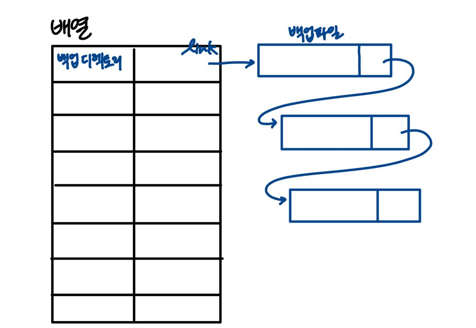

백업 프로그램
===============
210207
-------------

## 명세 설명 중 공부

### 1. 스레드(Thread)의 개념 :

- 어떤 프로그램에서 프로세스가 실행되는 흐름의 단위 의미.

- 프로세스는 적어도 하나의 스레드를 가지고 있고, 우리가 흔히 알고 있는 main 함수 역시 스레드라고 할 수 있음.

- 멀티 프로세스 vs 멀티 스레드 : 흐름이 동시에 진행된다는 것에서 공통점이 있음. 프로세스와는 다르게 스레드는 메모리를 공유한다는 차이점이 있음.

- 헤더파일로 `#include <pthread.h>`를 선언하여 사용.

- 기본적으로 thread를 사용하는 데 쓰이는 함수로는 `pthread_create`, `pthread_join`, `pthread_detach`,`pthread_exit`, `pthread_cleanup_push`, `pthread_self` 등이 있다.

### 2. 기본 Thread 함수(대부분 사용 예정인 것들로 공부) :

* Thread의 생성을 위해 사용하는 함수 :
	- `int pthread_create(pthread_t *thread, const pthread_attr_t *attr, void *(start_routine) (void *), void *arg);`
	- `thread` = 성공적으로 함수가 호출되면 이곳에 thread ID가 저장됨.
	- `attr` = 스레드의 특성을 정의. 기본적으로 `NULL` 지정. 만약 스레드의 속성을 지정하려고 한다면 `pthread_attr_init`등의 함수로 초기화해야 함.
	- `start_routine` = 어떤 로직을 할지 함수 포인터를 매개변수로 받음.
	- `arg` = `start_routine`에 전달될 인자를 말함. `start_routine`에서 이 인자를 변환해 사용.
	- 성공했을 때, `thread`를 초기화함과 동시에 0을 반환. 실패 시 `thread`인자가 설정되지 않고 에러값을 반환.

* 생성한 Thread가 끝날 때까지 기다려주는 함수 :
	- 만약 `thread`가 이미 종료되었다면 즉시 리턴
	- `int pthread_join(pthread_t thread, void **retval)';`
	- `thread` = 우리가 join하려고 하는 thread 명시
	- `retval` = `pthread_create`에서 `start_routine`이 반환하는 반환값 저장
	- 성공적으로 호출되면 0 반환. 실패 시 에러 넘버를 반환. 실패 시에는 '좀비 스레드'가 되고 이 좀비 스레드는 자원을 소모하게 되어 더이상 스레드를 생성할 수 없음.

* Thread가 독립적으로 동작하게 하고 Thread가 끝나면 자원을 반환하는 함수 :
	- `int pthread_detach(pthread_t thread);`
	- 때에 따라서 스레드가 독립적으로 동작하게 하고(`pthread_join`으로 기다리지 않고) 끝나면 알아서 `thread`를 끝내도록 하는 함수.
	- 독립적인 동작을 하는 대신 스레드가 끝나면 '반드시' 자원을 반환해야 하고, `pthread_create`만으로 스레드를 생성하면 routine이 끝나도 자원이 반환되지 않기 때문에 해당 함수 사용.
	- 성공 시 0을 반환하고 실패 시 오류 넘버 반환
	- `pthread_detach`와 `pthread_join`을 동시에 사용하는 것은 불가능.

* 하나의 Thread에서 실행 중인 다른 Thread를 종료하기 위한 함수 :
	- `int pthread_cancel(pthread_t thread);`
	- 인자로 주어진 스레드 식별자 `thread`를 가지는 스레드에게 종료 요청을 보냄.
	- 스레드가 종료 요청을 받았다면 해당 스레드는 `pthread_exit(PTHREAD_CANCELED)`를 수행. 종료시 리턴되는 값은 `PTHREAD_CANCELED`임.

* 생성과 동시에 detach 시키는 방법 : `int pthread_attr_setdetachstate(pthread_attr_t *attr, int detachstate);`

### 3. 스레드 동기화 :

* 스레드를 사용할 때 서로 '동시'에 실행하기 때문에 발생하는 공유자원의 잘못된 접근으로 인해서 문제 발생 가능. 때문에 공유자원을 하나의 스레드만 사용하게 하는 방법 = **동기화**

* 임계 영역(Critical Section)
	- 하나의 스레드만이 진입해야하는 특정 코드 구역, 공유자원의 변경이 일어날 수 있는 구간.
	- 스레드별 값들이 중구난방하게 나오는 경우를 알 수 있고, 이런 경우에 동기화 필요.
	```
	  thread2 cnt:0
	  thread1 cnt:0
	  thread1 cnt:1
	  thread1 cnt:2
	  thread2 cnt:3
	  ...
	```

* 뮤텍스(MutEx)
	- Mutual Exclusion의 약자로 '상호 배제'라고 함. 특정 스레드 단독으로 들어가야 하는 코드 구역에서 동기화를 위해 사용되는 동기화 기법.
	- `pthread_mutex_init` : 뮤텍스를 (동적)초기화하는 방법
	- `pthread_mutex_lock`, `pthread_mutex_unlock` : 뮤텍스를 이용하여 임계 구역을 진입할 때 그 코드 구역을 잠그고 다시 임계 구역이 끝날 때 풀면서 다음 스레드의 진입이 가능하도록 함.
	- `pthread_mutex_destroy` : 뮤텍스를 동적으로 생성했다면, 해당 함수를 사용하여 뮤텍스를 소멸함.
	- 실제로, `lock`과 `unlock`을 critical section 전후에 걸어주는 작업을 진행할 것.

### 4. `ssu_backup` 프로그램 개요

* 쉘을 구현하는 프로그램

* 명령어들을 위한 command 구조체 필요. 각각의 명령어마다 함수 필요.

* 프로그램을 실행 시 지정 경로에 백업 디렉토리 생성
	- `mkdir`을 통해서 디렉토리 생성 or `opendir`로 있는 디렉토리가 백업 디렉토리로 사용
	- 입력받은 디렉토리를 찾을 수 없다? 경로가 잘못되었다 or 있는 디렉토리가 아니다
	- 맥락상 두 가지 모두 후자로 추정. 전자의 경우 생기는 의문점에 대해 여쭤보기

* usage : 현재의 경로 출력? cpu 사용량?

* 프롬프트로 제어가 넘어감 : `ssu_backup` 프로그램 종료

### 5. 로그 파일 기록 개요

- 기존 로그 파일을 사용할 것이 아니기 때문에 헤더 파일 `#include <syslog.h>` 선언 X

- `enum` 등을 사용해서 로그 기록에 대한 구조체를 선언 후 해당 구조체의 형식에 맞게 로그 파일에 기록

- ~~시간의 경우 헤더 파일 `#include <sys/time.h>`를 사용해 `int gettimeofday(struct timeval *tv, struct timezone *tz)` 함수 사용 예정. (CPU 시간만을 재는 `clock`은 측정에 오류가 있을 것으로 판단)~~

- `stat`이라는 함수를 이용해 해당 파일의 정보들을 사용하여 저장하는 방식으로 진행.

- 백업해야 할 파일명 제한에 대해서는 조금 더 찾아보기.

### 6. 백업 개요

- `list`라는 연결리스트에 각 파일들의 정보 저장

- `PERIOD`라는 백업 주기마다 백업을 진행해야 하는 부분. 여기에서 `PERIOD`의 의미에 대해 보충 설명을 들어야. (명령문 1개를 '1'로 여기는지, 시간 1초를 '1'로 여기는지 등)

- `mtime`의 경우 `stat` 함수에서 쓰이는 `stat`에서 가지고 있는 정보들 중 `time_t st_mtime`을 의미.

- `recover` 명령어의 경우 어떻게 구현할지 좀 더 상상해보고 짜볼 필요 O

### 7. 참고적으로 구현에 필요한 함수에 대해 공부

* `pthread_cond_init`, `pthread_cond_destroy`
	- 스레드 1과 스레드 2가 있을 때, 스레드 2는 항상 스레드 1의 값 변동 이후 명령문을 실행하는 조건이 있을 경우에 스레드 2가 스레드 1을 지속적으로 확인 및 감시하는 것이 아니라 특정 조건이 발생했을 때 signal을 보내서 감지할 수 있도록 = 조건 변수 사용
	- `int pthread_cont_init(pthread_cond_t *restrict condition, const pthread_condattr_t *restrict attr)` : 조건 변수를 초기화. `condition`이라는 조건 변수를 초기화하는데 `attr`로 속성을 지정. `NULL`이면 기본 조건 변수 사용.
	- `int pthread_cond_destroy(pthread_cond_t *condition)` : 조건 변수를 삭제하고, 조건 변수에 할당된 자원을 해제. 어떤 스레드도 해당 조건 변수를 기다리고 있으면 안됨.
	- 필요에 의해서 `pthread_cond_wait` 또는 `pthread_cond_siganl`을 사용하는 경우도 생각해야.

* `getopt()`와 `system()`에 대해서 공부 예정.

* * *

210208
------------

## 명세 설명 중 공부

### 0. 명세 공부 중 보충

- `pthread_cond_init`, `pthread_cond_destroy` 등의 명령어는 활용하지 않아도 프로그램 구현 가능.

- `pthread`함수 중 `pthread_detach`와 `pthread_cancel`을 잘 사용할 것.

- usage : 사용 방법을 알려주라는 의미. `Usage : [디렉토리명]` ex) `Usage : ./ssu_backup`

- 생성할 백업 디렉토리를 인자로 넣어주지 않는 경우, 임의의 이름을 가진 백업 디렉토리 생성

- 로그 파일은 파일 입출력을 통해서 `logfile`이라는 것을 만들고 수행.

### 1. 명세 추가 공부

* 로그 파일 기록) 파일명 제한
	- `add` 명령어를 통해 백업해야 할 파일이 추가되면서 백업이 처음으로 이루어지기 때문에 해당 명령어에 파일명 제한 조건을 넣는 것 생각.
	- 1byte = 문자 1개. `strlen`을 통해 나오는 값이 255보다 작거나 같아야 함.

* 백업) `recover` 명령어 구조
	- 로그 파일 내 파일 경로와 인자로 입력한 파일 경로 중 일치하는 경로 찾기
	- 경로가 일치하는 로그들의 정보를 리스트로 띄움. (연결ㄹ스트에서 찾아서) 띄울 때 백업시간 기준 오름차순으로 출력할 것.
	- 만들어진 쉘로 들어오면서 입력한 백업 폴더 내에 있는 파일을 복사해서 덮어 씌우기 or `w` 모드로 열어서 내용 넣기

* system() 함수
	- 헤더 파일로 `#inclue <stdlib.h>`를 선언 후 사용 가능.
	- `int system(const char* command);`
	- Shell 명령어를 실행하기 위한 함수
	- `command`에 지정된 명령어를 실행하며, 명령어가 끝난 후 반환. 리턴된 값은 호출이 실패한다면 127, 다른 에러가 있다면 -1, 그렇지 않으면 명령어의 리턴 코드가 반환.

* 연결리스트 구조


* argc, argv 등의 개념
	- argc는 실행 파일과 함께 입력한 인자들의 개수를 카운트
	- argv는 문자열로 저장된 인자의 주솟값을 배열형태로 저장. 공백 단위로 끊어서 인덱스에 하나씩 저장

## 실제 수행 항목

### 1. 헤더 파일 작성

- 구조체 및 필요 함수 선언

### 2. 메인 파일 작성

- 쉘의 기본 구조 작성(첫 입력과 기본 출력)
- linkedlist 구조 구현 중

* * *

210209
--------------

## 명세 공부

### 1. `ssu_backup` 파일 기본

- `pwd` 즉, 현재 경로를 가지고 있는 상태에서 상대 경로가 입력되면 현재 경로를 의미하는 `./`를 덧붙여야 하는가. -> 일단 덧붙여서 진행해보기

- `list`는 연결리스트 내에 존재하는 파일 경로와 period를 출력하면 될 것(연결리스트 노드 구조체 안에 period 부분이 있어야 함)으로 판단.

### 2. 명령어별 명세

* `add`
	- 백업해야 할 파일이 일반 파일인지 확인 -> `stat`에서 파일 유형인 `st_mode`를 확인. regular file을 의미하는 01000001(bit단위 표현) 인지 확인. or 파일의 종류를 체크하는 POSIX macro 사용. 일반 파일 여부인 `S_ISREG(buf.st_mode)` 사용. 뿐만 아니라 디렉토리 등의 여부를 체크하는 데에도 쓸 예정.
	- 백업해야 할 파일이 백업 리스트에 존재하는지 확인하기 위해선 `logfile` 체크
	- 백업 주기마다 해당 파일을 백업하기 위해서 어떤 작업이 필요할지 -> 스레드를 필요할 때마다 만들어주거나 반복문을 때에 맞춰서 만들어주는 작업은 비효율적일 것으로 판단. 리눅스에 있는 `crontab`이란 명령어를 c에 적용할 수 있는지. or `while do sleep done` 명령어를 좀 더 공부해보고 사용 가능한지 판단 예정.

* `remove`
	- 해당 명령어를 통해서 연결리스트 `node`의 삭제까지 진행할 수 있도록 함.

* `system` 함수 사용
	- `system` 함수로 `ls`와 `vi` 명령어를 사용해야 하는 부분을 확인 중. 아직은 어느 부분에서 사용해야할지 감을 못잡음.

## 구현

- `ssu_backup` 파일 실행 시 초기 화면의 조건 구현 중.

* * *

210210
----------------

## 명세 공부

### 1. `ls`, `vi`, `exit` 명령어

- 프롬프트에서 실행 가능한 명령어.

- `ls`, `vi`는 `system`함수와 함께 실행하여 보일 예정. 둘 다 `mkdir`함수로 만든 디렉토리 내에서 진행하면 될 것으로 판단.

- `vi`와 `vim` 모두 적용가능하도록 진행해야 할 것으로 판단.

### 2. `add` 명령어

- 특정 주기를 기준으로 파일을 백업하는 경우, `while`문을 사용해 `sleep`으로 주기 동안 일시 정지할 수 있도록 설정. 이 방법으로 주기를 두고 반복할 수 있도록 설정 가능할 것으로 판단 -> 구현 중 오류를 느끼면 방법을 다시 찾고 변경하기로.

## 구현

### 1. 기본 화면

- `ssu_backup`을 실행하면서 받은 인자들에 대한 조건 설정 완료

- `ssu_backup` 파일을 실행한 쉘에서 받아들인 명령어에 따른 처리 부분 진행 완료

- 디렉토리 이름을 기준으로 배열에 저장하기 위해 사용할 '인덱스' 처리를 어떻게 할지 고민중 -> 0부터 진행하여 `NULL`인 곳에서 저장하는 방법을 생각. 진행하기로 결정.

- 연결리스트에 쓰일 노드 구조체 변수 변경(`period`라는 변수 추가)

### 2. `add` 명령어

- 연결리스트를 위한 노드를 만드는 함수와 배열에 인덱스를 설정하여 파일 이름 및 링크를 설정하는 작업 완료.

- add 명령어 기본 부분의 오류 처리 진행 중.

* * *

210215 공부한 내역
-------------

## 구현

### 1. `add` 명령어

- `PERIOD` 옵션이 실수형으로 입력되었을 때 에러 처리를 진행하는 부분에서, 데이터 타입을 구분할 수 있는 요소가 무엇인지 검색 중. 크기의 경우, `int`와 `float`이 4byte이기 때문에 구분이 불가능할 것이라 판단. 어떠한 방법으로 구분 가능한지 찾는 중. (기존에 찾았던 문자와 정수 구분 방법은 해당하지 않을 것이라 생각)

- 로그 관련 및 위에 작성한 오류를 제외한 `add` 명령어의 예외처리 진행 완료. (예외처리 후 `return` 하는 것은 추후에 추가할 예정)


- 백업 리스트 추가 및 삭제를 진행하는 스레드가 필요하다고 판단했으나 어느 부분에서 스레드를 만들고 진행하는 것이 좋을지 생각 중.(일단은 제외하고 진행)

### 2. 로그 파일

- 로그 파일 구조체 완성. 기존에 생각했던 `enum`의 경우 프로그램에서 값을 변경하는 작업 진행이 어렵기 때문에 `struct`로 진행하고자 함. (로그 파일 내의 로그들을 연결리스트로 진행할 경우 `link` 추가 예정. 일단은 연결리스트로 하고자 했으므로 추가하기로 함.)

- 처음 해당 프로그램이 시작될 때 로그 파일의 유무 판단 및 생성 작업 완료.

- `add` 작업 이후 `logfile`에 반영하는 부분 진행 중 (시간 부분, link 부분 진행해야)

- 시간 부분은 스레드를 사용한 후 적용해야 할 것으로 판단. 스레드를 만드는 부분 생각할 것.

### 3. remove 명령어

- `logfile`을 확인해야하는 예외처리를 제외하고 예외처리 완료. (`add` 명령어와 동일하게 `return`부분 추후에 추가 예정)

* * *

210216
-------------

## 명세 및 조언

### 1. 문자열 입력받기

- `scanf`를 사용하기보다 `fgets` 명령어를 사용하는 것이 좋음 -> 변경 완료.

### 2. 명령어의 예외 조건

- 백업 파일이 백업 리스트에 있는지 확인하는 것은 '로그 파일'을 참고하여 진행하는지 `list` 명령어로 보여주는 목록에서 진행하는지. (일단은 로그 파일을 먼저 만들었기에 로그 파일로 진행.)

### 3. `add` 명령어

- `PERIOD`로 실수가 입력되었는지 확인하는 두 가지 방법 : 문자열로 받은 `PERIOD`에 소수 표현을 위해 필요한 '.'이 있는지 확인하기 또는 1.0으로 나누었을 때 나머지 값이 0인지 아닌지 확인하기 (후자 선택해서 진행)

## 구현

### 1. `add` 명령어

- 백업 리스트에 백업 파일이 있을 경우에 에러 처리를 진행하는 예외처리 완료.

- `list` 명령어를 통해서 확인하기 위한 작업은 아직 진행하지 않음.

### 2. 로그 파일 작성

- 로그 파일 내에 있는 각각의 로그를 작성하는 부분은 함수로 넘어가서 진행하기로 결정. (로그 작성 함수의 경우 수정, 추가, 삭제 등을 나누어서 함수를 만드는 방법으로 진행.)

- 로그 작성 함수 중 추가와 삭제 진행 완료.

- 만들어낸 로그 내용들(연결리스트)를 로그 파일에 넣는 함수 완료.

- 유의할 점 : 시간 부분 제외하고 진행.

### 3. `remove` 명령어

- 백업 리스트에 백업 파일이 있을 경우에 에러 처리를 진행하는 예외처리 완료.

- 연결리스트에서 삭제하는 작업 진행 완료.

* * *

210217
--------------

## 명세 및 조언

### 1. 문자열 합치기

- `strcat`으로 파일의 경로 및 로그 파일 안에 있는 로그들을 `sprintf`를 사용해서 작성하는 것이 더 바람직하다는 조언 반영.

### 2. 수행 및 접근 시간 표현

- `stat` 구조체 내에 존재하는 'time of last access' 를 의미하는 `time_t st_mtime` 또는 `st_atime`을 사용하는 방식은 스레드를 사용하는 방법과 관련이 크지 않을 것이라고 생각. -> `st_mtime`과 같은 방법을 쓰고자 했던 이유는 `compare` 명령에어도 해당 `stat`을 비교하는 것으로 미루어보아 이를 활용해 시간을 알 수 있다고 생각했음.

- 일단은 `clock_gettime`과 `gettimeofday`를 사용하는 방법을 다시 찾아보았지만 대부분 용도가 '실행하면서 걸리는 시간'을 측정하는 것으로 판단. '접근하는 시간'을 측정하기에 적합하지 않을 수도 있다는 생각. 일단 해당 함수들의 사용 방법 및 예시들을 좀 더 상세하게 공부할 것. (`clock`보단 `gettimeofday`가 더 정확한 linux의 시간 값을 가짐. 하지만 `gettimeofday`의 경우 초와 마이크로초를 저장하기에 나에게 필요한 함수인지 의문.)

- 스레드의 주기를 설정(`pthread_wait`)하여 원하는 `PERIOD`를 기준으로 실행할 수 있다는 것 생각하기.

## 구현

### 1. 로그 파일

- `recover` 명령어를 사용했을 때 로그 파일에 쓰일 로그의 내용에 대한 함수 작성 완료.

### 2. `list` 명령어

- `list` 명령어를 쳐서 출력되는 값들은 링크드 리스트의 값들을 출력하기로 결정. (파일 경로와 `period` 두 가지가 출력되면 되기 때문)

- `list` 명령어에 대한 함수 구현 완료.

### 3. `compare` 명령어

- `mtime`과 파일 크기를 비교하는 과정 수행 중.
