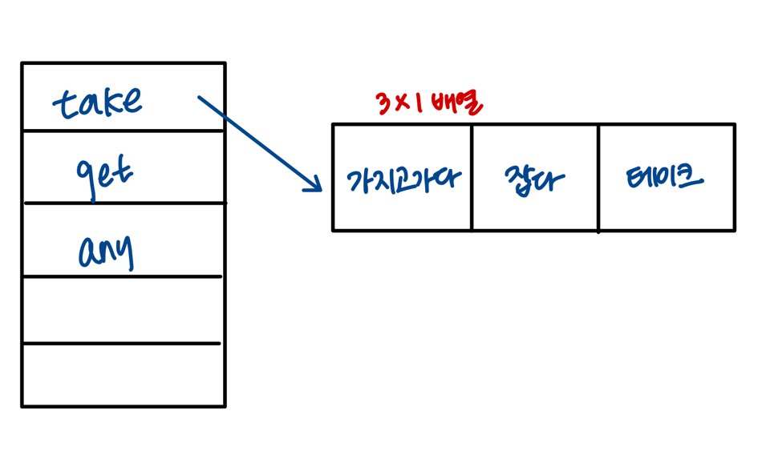
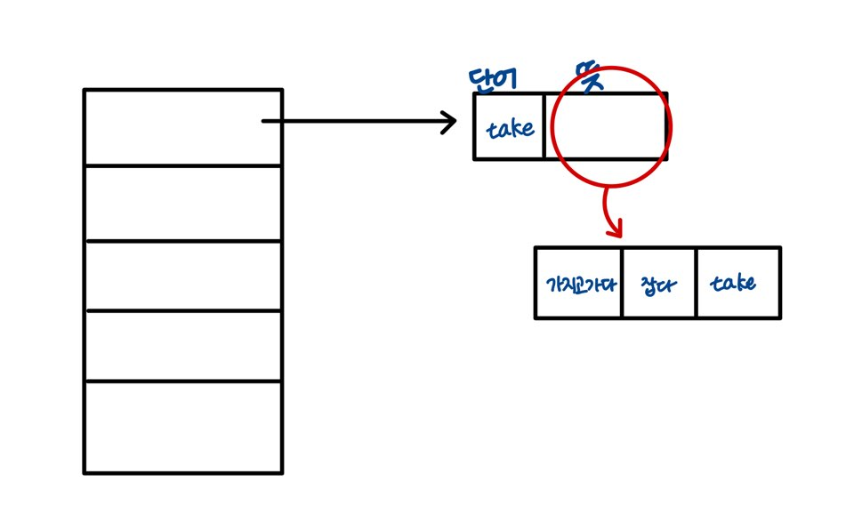
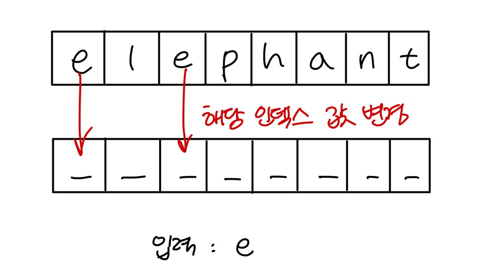
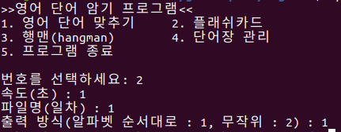

영어 단어장
==============
210122
--------

## 명세 설명 중 처음 들었던 용어 공부

### 1. 단어장 관리(fopen)

- fopen 형식 :
`#include <stdio.h> FILE *fopen(const char *path, const char *mode);`
ex) 
`FILE *fd = fopen("./test.txt", "w")`

- 적용 : 여기에서 나는 '단어장 보기'를 진행할 것이기에 '읽기 전용'으로 읽으면 된다. 즉, mode = "r"

### 2. (플래쉬카드) system clear

- system clear 형식 :
`#include <stdlib.h> void main(){ system("cls"); }`

- system clear 의미 :
clear 메소드가 호출되면 커서가 창의 왼쪽 위 모퉁이로 자동으로 변경되고, 화면 버퍼의 내용이 현재 전경색을 사용해 공백으로 설정된다 -> 콘솔의 화면에서 작업한 내용을 지울 수 있다.

- 직접 사용해봤던 리눅스 명령어 'clear'와 동일하다 생각.

- 화면 이동 및 메뉴 이동 등에서 사용 예정.

## 명세 중 개인 공부

### 0. 단어 저장과 링크드 리스트 사용 등을 연결하는 것에 대한 사고

- 단어 저장 : 3 * 3 형태 또는 4 * 3 형태의 2차원 배열의 파일 (한 단어장 기준) vs Linked List를 가리키는 1차원 배열 파일

- Linked List 사용 등 : 1가지 영어 단어에 대한 모든 뜻 도출 -> 1차원 배열이 가리키는 것 필요

=> 결과적으로 생각한 두 조합



이 중에서 먼저 1번째 조합으로 시도해 볼 예정.

### 1. 영어 단어 맞추기

- 출력 방식 2가지 : 알파벳 순서대로, 임의의 순서대로

- ~~아예 저장할 때 알파벳 순서대로 저장(오름차순) 하는 방식을 생각. 알고리즘에서 진행했던 sort방식들 중 하나(버블이나 선택을 우선으로 진행하고, 런타임이 오래걸리면 변경 여부 생각할 예정)를 적용하고자 함.(해당 메뉴에서만 오름차순 단어들이 사용되는 것이 아니라, 다른 메뉴들에도 적용되기 때문)~~ **[조언] 단어 파일에 저장할 때 순서대로 저장하는 방식이 매우 어려울 수 있으므로, 단어 리스트들을 불러올 때 불러온 후 정렬하는 방식 추천.** 관련된 함수를 찾고자 했으나 sort함수는 파일에서나 적용됨.(이건 dic라는 영어 단어장들을 정렬하는 데 사용하면 좋을 것으로 생각하지만, 파일 목록과 관련된 파일이 아예 따로 존재해야 할 것 으로 추측)

- 나머지는 반복문, if문 등을 사용하면 될 것

### 2. 플래쉬카드

- clear을 사용해서 반복 출력 시간마다 clear 진행 -> 영어 단어 / 한글 뜻 출력 순서

- 사실 해보지 않은 기능이다 보니 먼저 시도해보는 방식으로 생각. '반복 출력 시간 마다' 변해야 하는 영어 단어 / 한글 뜻과 관련된 방법으로는 해당 초를 (1초 = 1000msec)일정 시간 '딜레이' 하는 방식으로 적용 -> Sleep 함수 사용. ~windows.h~ **unistd.h**를 참조하여 사용 가능 ex) `Sleep(1000);` = 1초 쉬기

- 단어장의 단어가 모두 끝나면 그냥 끝나는 걸까? 혹은 그냥 계속 진행? 이 부분은 질문

### 3. 행맨

- 무작위로 출력된다 -> random 사용

- 단어를 알파벳 단위로 모두 나눌 수 있어야 함 -> 특정 함수 (strtok)의 경우 '토큰' 즉, '널문자' 단위로 끊는 경우이기에 strlen을 이용한 방법 생각 중. strlen으로 출력되는 숫자만큼 _ 을 출력하고 배열의 0부터 strlen의 값까지 반복문으로 돌리면서 맞는 문자 있는지 확인. 맞는 게 있으면 변경.
(이 부분에서 '위치' 관련해서 생각한 건 _ 역시 하나의 배열에 위치시켜 일치하는 인덱스 값을 변경해주는 방식으로)



- 축하 메세지는 system clear 적용 X

### 4. 단어장 관리

- 새로운 단어장(새 파일) 추가 : 스페이스 바 단위로 배열에 Linked List 연결까지 진행해야 함. (처음 0번에 제시했던 이미지 참고)

- 새로운 파일명이 기존 파일명 +1.dic 여야 한다 -> 기존 파일명에 해당하는 숫자를 저장해야할까? 이 부분은 조금 더 찾아보기

- 영어 단어 길이, 한글 뜻은 strlen으로 설정 가능할 것으로 예상.

- 최대 20개의 단어는 배열의 크기를 기준으로 설정 가능할 것으로 생각.

- 단어장 보기 : 이미 오름차순으로 정리되어있는 순서대로 출력할 것.

- 단어 파일 목록 보기 : ~~단어 파일 목록을 가져올 수 있는 `<io.h>` 헤더파일에 정의되어 있는 `_finddata_t` 구조체의 `findfirst` 를 사용할 수 있는지 확인해보면 좋을 것으로 예상. (dic라는 이름이 포함되어있는 아이들만 출력하는 방식으로)~~ **[조언] 단어 파일 목록 불러오기는 `dic.list`에 있는 것들을 불러오면 된다.**

* * *

> 210123 진행 계획
> Linked List 형태 단어장 생성하기
> 1번 메뉴 / 2번 메뉴 진행하기

* * *

210123
-------------

## 수행 예정 항목

### 1. 링크드 리스트 형태 단어장 생성
### 2. 1번 메뉴 / 2번 메뉴 진행하기

## 실제 수행 항목

### 0. 210122 명세 분석 중 해결하지 못한 부분

* 파일 목록을 저장하는 `dic.list` 파일을 어떻게 해야할까?
	- 파일 리스트를 파일로 저장하는 `_wfopen(fopen)` 기능과 저장할 파일 리스트들의 특정 경로를 지정하기 위해 `_wchar(char)` 형의 path를 설정해준 후, 특정 함수 (위에 언급된 `_finddata_t`와 `_findfirst` 등)를 이용해야 하는 것으로 보임.
	- 임의적으로 파일명을 해당 파일에 저장해주는 것이 아니면 이러한 방식밖에 찾지 못한 것 같음.

* 새로운 단어장 생성 시 +1.dic 로 어떻게 생성할까?
	- `for`로 1부터 진행해서(+1 진행중) 이미 존재하는 파일이면 넘어가고, 존재하지 않는 파일이면 그 순간 바로 저장. `rename`을 이용해야할까?

### 1. 단어장 생성하기

(단어장을 링크드 리스트 형태로 부르는 건 메뉴마다 각각 부르는 게 나을 것 같다고 생각해서 기본적인 틀을 생각하는 단계입니다)
- 링크드 리스트를 원소로 갖는 배열을 생성해야 한다고 생각 : 링크드 리스트 구조체를 node로 선언

- 단어 = 문자형태 배열(단어길이 최대 15자), 뜻 = 문자형태 배열(뜻 길이 최대 30자)(뜻의 경우엔 배열을 받아들일 수 있는 크기가 3인 배열 안에 각각 위치시켜야)


### 2. 초기 화면

- 초기 메뉴 화면 파일 구성 완료(word.c 파일로 구성)

- 다음 화면을 넘어갈 시에 clear와 fopen 사용할 예정 -> 이렇게 되면 변수 값들은 저장될 것이고 다른 파일의 경우에도 출력이 끝나면 메뉴가 자동으로 출력되도록 fopen을 통해서 진행 가능.

- scanf에 받아들일 값 외의 값을 넣으면 출력에 오류 발생 -> printf로 변경하고 scanf를 위해 쓰이지 않는 print의 값들은 printf + '\n' 대신 puts를 사용해서 넣음 (ex. 메뉴 출력 등)

- fopen은 메뉴에 각각 해당하는 파일들을 제작한 후에 넣을 예정 (추후 수정)


### 3. 1번 메뉴 | 영어 단어 맞추기

(단어장 생성하기 부분 진행 (링크드 리스트 구조체와 뜻을 담을 배열 생성 및 저장. fgets 사용)
- `fopen`, `fgets`, `fseek`, `feof` 를 사용.
- `fopen`을 통해서 아예 '해당 문서가 실행' 되는 것을 가능하게 하는 방법을 검색중. `fopen`의 경우 대부분 해당 파일의 내용을 읽어서 보여주는 것이기에 '실행'되는 것이라고 보기에는 힘들다고 생각.
- 아직 진행 중!

* * *

> 210123 ~ 210124 진행 계획
> 1번 메뉴 진행
> 2번 / 3번 메뉴 진행

* * *

210124
--------------

## 수행 예정 항목

### 1. 1번 메뉴 진행하기
### 2. 2번 메뉴 / 3번 메뉴 진행하기

## 실제 수행 항목

### 0. 명세 관련 수정 사항(조언 기반)

* 파일 목록을 저장하는 dic.list 파일은 어떻게 파일 목록을 불러들일까?
	- `opendir`과 `readdir`을 사용하고 조건문을 통해 확장자가 dic로 끝나는 파일들을 읽어들이는 것으로 진행하면 좋을 것이라고 판단.

* 항상 +1.dic가 만들어지는 경우를 어떻게 만들 수 있을까?
	- `fopen`의 리턴값이 `NULL`이 나오는 순간을 찾는 것. `1.dic`, `2.dic` 등등 열어나가면서 열리지 않는 순간 즉, `NULL`이 리턴된다면 그때의 파일명으로 파일을 저장함.

### 1. 1번 메뉴
	
- `fopen`을 통한 열기 결과가 출력이 안되는 문제 발생
(코드) (원하는 내용물 출력을 목표로 하는 것이 아니라 시험용으로 fopen과 fgets가 잘 작동하는지 확인하고자 하는 부분에서 진행 오류)
```
int main () {
	char buffer[50000] = {0};
	fp_out = fopen("./1.dic", "w");
	fgets(buffer, sizeof(buffer), fp_out);
	printf("%s\n", buffer);
	return 0;
}
```

- 재차 확인을 위해 구글 서치 결과로 존재하는 코드 작성 -> 결과 출력 안됨
(코드)
```
#include <stdio.h>
int main() {
	FILE* fs;
	fs = fopen("1.dic", "r");
	while(feof(fs)==0) {
		char str[1000];
		fgets(str, 1000, fs);
		printf("%s", str);
	}
	fclose(fs);
}
```

- 진행 중 확인) `1.dic` 파일의 내용이 모두 삭제되어있는 상태였음. -> 파일 재다운로드 후 진행 -> 구글 서치 코드와 제작 코드 성공적으로 돌아감. (필자 개인 의견으로, 파일을 여는 모드를 `"w"`로 설정하여 해당 파일이 초기화된 것으로 생각. 구글 서치 코드 실행 -> 제작 코드 실행 순서로 진행했을 때, 제작 코드는 다시 어떤 것도 출력하지 못했고 다시 1.dic파일의 상태를 보니 초기화된 것을 확인함. 제작 코드를 수정하는 과정에서 fopen의 열기모드를 `"r"`로 수정한 후 다시 단어장 파일들을 다운받아 진행했을 때 원만하게 결과 출력)

- `feof` 등을 이용하여 코드 수정 진행. 마지막 줄의 단어와 뜻이 한 번 더 출력되는 오류 발생 -> 어떤 부분이 잘못되었는지 찾는 중.(아직은 발견못함)

- 구조체 `Linklist`를 저장할 배열 `list[30]`을 만들고 파일 `1.dic`의 내용을 `fscanf`로 받아서 저장하는 방법을 진행하고자 함(공백 단위로 나누는 방법을 위해 `fgets` -> `fscanf`로 변경. `fgets`를 하면서 반복 조건으로 `fseek`를 사용해 공백이 발생하면 포인터의 위치를 바꾸는 식으로 진행해볼까 했으나 이런 방식을 진행하기엔 미흡한 점이 많음)
* 이 부분에서도 문제 생각 : 여러 가지 뜻을 가지고 있지 않은 경우 어떻게 할 것인가? 형식을 `"단어 뜻1 뜻2 뜻3"` 으로 지정하게 되면 무조건 형식에 맞춰야하기 때문에 문제 발생. 일단은 진행해보는 걸로.

- 이외에도 `scanf`에서 받아들이는 형식 `"%s"`와 해당 값이 저장될 `list[i].data`, `list[i].mean1`, `list[i].mean2`, `list[i].mean3`를 지정 후 잘 저장되었는지 출력해보는 과정에서 오류 발생(이상한 문자 출력) -> 문제 해결 방법 찾아보기로. list의 형, 구조체 속 값들의 형, 저장될 값들을 다른 모습으로 바꾸는 방식 등을 진행했으나 효과 X. 다른 방식을 찾아보기로. (더 크게는 `fscanf`가 아닌 다른 방식을 찾아보는 것도 고려해야)

### 2. 2번 메뉴

- 전체적인 구조를 바탕으로 코드 짜기 진행. (세부적인 것들 제외)

- 단어들을 열고, 데이터를 얻어서 링크드 리스트에 저장했다고 가정한 상태로 코드를 짬. (가정한 부분들은 1번에서 언급한 것들을 해결하고 추후 수정 예정)

- 출력 방식을 알파벳 순으로 지정했을 경우 새로운 배열에 저장할지 혹은 해당 배열에서 순서를 바꿀 것인지 생각. 새로운 배열에 저장하는 방식은 너무 많은 메모리를 차지할 것이라고 생각하기에 있는 배열에서 순서를 바꾸는 방법을 우선적으로 진행해볼 예정)

- 단어들을 모두 출력한 후 메뉴 화면으로 돌아가기 위해 return을 하면 되는지, 해당 메뉴 파일을 다시 오픈해야 할지 생각 중.(넘어온 화면에서 돌아가는 것이라고 생각해서 return을 생각중이긴 하지만 이 방식에 대해선 좀 더 찾아보기로)

- 기본적인 기능 = 단어 / 뜻을 출력하고 원하는 시간동안 정지 -> 화면 clear 단계는 구현 완료.

* * *

> 210125 진행계획
> 링크드 리스트 완벽히 구현하기
> 1번 메뉴, 2번 메뉴 진행하기

* * *

210125
-----------

## 수행 예정 항목

### 1. 링크드 리스트 완벽히 구현하기
### 2. 1번 메뉴, 2번 메뉴 진행하기

## 실제 수행 항목

### 1. 링크드 리스트 완벽히 구현하기
- `fscanf`를 사용하는 방법이 아니라 `fgets`를 사용해서 읽어낸 후, `strtok`를 통해서 특정 토큰 즉, 공백을 기준으로 해서 나눠보는 방법을 선택. 문자열은 `strcpy`를 통해서 구조체에 저장하는 방식을 선택하여 진행 시도.

- `strcpy` 명령어와 `strtok` 명령어를 사용한 예제 코드를 이해하고 이를 활용하기 위해서 새로운 명령어들을 익히고 이해하는 데 시간 소요.

- **strcpy**
	* 헤더 파일 : `<string.h>`
	* 함수 원형 : `char* strcpy(char* dest, const char* origin);`
	* `origin`에 있는 문자열 전체를 `dest`로 복사하는 함수.

- **strtok**
	* 헤더 파일 : `<string.h>`
	* 함수 원형 : `char* strtok(char* str, const char* delimiters);`
	* C 스타일 문자열인 `str`을 분리할 기준이 되는 `delimiters`로 구분함.
	* `strtok(NULL, " ")` :  문장의 의미는 NULL이 매개변수로 들어오면면, 이전에 자신이 기억한 곳에서부터 분리를 시도한다는 의미.

- 코드 저장 후 시험 출력한 내용 중 지속적으로 마지막 단어와 뜻이 한 번씩 더 출력되는 점 확인 -> `fread` 함수로 한 번 더 읽어서 조건문을 거는 방법 또는 `fgets`에서 조건문을 사용하는 방법을 알아냄. -> 실제로 함수에 `fgets`가 사용되기 때문에 후자의 방법을 선택해 진행. 예제 코드와 실제 제작 코드에서 성공적인 결과를 보임.

- `Linklist`구조체를 저장하는 `list`라는 배열에 저장 완료 -> 이제 어떤 방법으로 이러한 단어 저장 형태를 줄 것인지 생각해야.
	* 현재 메뉴를 보여주는 초기화면 -> 배열 및 링크드 리스트에 저장하는 파일 실행 -> 원하는 메뉴의 화면으로 넘어가기
	* 원하는 메뉴의 화면으로 넘어가서 배열 및 링크드 리스트에 저장하는 활동 진행

### 1번 메뉴, 2번 메뉴 진행하기

- 1번 메뉴, 2번 메뉴에서 모두 필요한 사전 순서 정렬을 진행. 정렬은 따로 함수를 만들어서 진행. (선택 정렬 또는 버블 정렬로 진행하기로 함. 후자를 먼저 진행했으나, 방식에서 문제가 있었는지 모르겠지만 적용되지 않는 것 확인. 수정해야함.)

- 1번 메뉴) 한글 뜻으로 문제가 나오는 부분에서 이 중 어떤 것을 의미하는가
	* 한글로 된 뜻 세 개를 한 번에 모두 다 출력해야 하는지
	* 셋 중 하나의 뜻만 출력하면 되는지 **(일단 이걸로 진행)**
	* 셋 중 하나씩 돌아가면서 출력해야 하는지(예를 들어 '가지고 가다', '테이크', '잡다'의 뜻을 가진 단어의 경우 처음 나오는 문제가 '가지고 가다', 두번째 나오는 문제가 '테이크' 마지막이 '잡다'라는 문제가 나오는 형태)

- 1번 메뉴의 기본적인 기능 구현 완료. 아직 두 가지 오류가 있으므로 그 부분을 해결해야 함.
	* 점수가 0.00 또는 1.00으로 출력되는 부분
	* 저장된 단어에 `\n`이 추가되어서 출력되는 부분 (아마 단어 저장 부분에서 오류가 있을 것으로 생각)

- 2번 메뉴는 링크드 리스트 즉, 단어장을 넣어서 시험해볼 예정. 기본 구조는 갖추었고 필요한 부분 수정 완료.

- 3번 메뉴에서 제공되는 한글 힌트 또한 뜻 하나? 혹은 전부 다? 출력되는지 알아볼 것.

- 3번 메뉴의 행맨 그림 그리는 중.

* * *

> 링크드 리스트 수정 진행
> 1번 메뉴 완료
> 2번 메뉴 진행, 3번 메뉴 진행

* * *

210126
-------

## 수행 예정 항목

### 링크드 리스트 수정 진행
### 1번 메뉴 완료
### 2번 메뉴, 3번 메뉴 진행

## 실제 수행 항목

### 1. 링크드 리스트 수정 진행

- 현재 문제 : '개행문자'가 포함되어 있음. 출력했을 때 단어 앞 공백이 있는 단어들 존재.

- `strchr` 함수를 사용해서 개행문자를 찾는 방법 생각. 찾은 개행문자를 `'\0'`로 변경해주는 방법 생각 -> `strchr`로 `'\n'`을 찾아서 바꾸는 방법 성공.

- **strchr** :
	* 헤더 파일 : `#include <string.h>`
	* 함수 원형 : `char *strchr(const char *s, int c);`
	* 문자열 s에서 원하는 c라는 문자를 찾아주는 함수

- 출력했을 때 단어 앞 공백이 있는 단어들 : 첫 번째 뜻과 두 번째 단어 사이에 스페이스가 2개 있는 것으로 출력됨 => `strchr`로 `' '`를 찾아서 바꿔주는 것 가능한지 확인 => `''`은 empty 상태라 바꾸는 것 불가능. `'\0'` 으로 바꿨을 때는 함수에 이상 발생. 일단 수정하지 않고 진행해보고, 이후에 이상 생기면 수정하는 방향으로

### 2. 1번 메뉴 완료

- 현재 문제 : 스코어 출력 오류, 알파벳 순 정렬

- 스코어 출력) `int`형을 `double`형으로 변경해주는 것, `나눗셈으로 나온 값 * 100`을 진행하는 것이 필요했음. 해당 부분은 형 변환 및 수정을 진행해 결과 출력 성공.

- 알파벳 순 정렬) 오류 발생 -> 링크드 리스트 구조 및 구현 부분에서 오류가 있어서 그런 것으로 생각. 링크드 리스트 및 단어장 수정 진행 -> 하던 중 끝도 없을 것 같다는 생각에 다시 원본 파일에서 수정 진행 ... 일단 다시 해보기로 -> 정렬 부분이 잘못되었던 것. 다시 생각 후 수정 진행하니 원만하게 수행.

- 정렬에서 한 가지 문제점 발생. 정렬에서 아무것도 없는 값이(빈 값) `list[0]`에 저장된 것을 확인 -> 왜? 일단은 원인을 찾아보기로하고(아직까지 발견X) `list[1]부터 돌아가는 것으로 임시 변경.

- 메뉴로 넘어가고 넘어오는 부분으 마지막에 수정 진행.

### 3. 2번 메뉴, 3번 메뉴 진행

- 2번 메뉴에서 필요한 정렬의 경우 1번에서 제작한 sort와 동일한 코드 입력 -> 똑같이 문제가 있는 분이 있을 것이라 생각했으나 없어보임. 1번 메뉴 코드와 2번 메뉴 코드 재확인 필요.

- 2번 메뉴에 링크드 리스트 즉, 단어장을 예시로 집어넣고 진행. 출력에서 `sh: 1: cls: not found`라는 오류 문구 등장 -> Linux 환경에서는 `system("cls")`가 작동하지 않는 것 확인 -> `system("clear")`로 진행해야 함.

- 2번 단어 및 뜻 출력에서 오류 발생. 디버깅 결과, `for`문 안으로 들어가지 않는 것 확인. 변수명, `for` 조건 등 변경해보고 단어 저장 여부 등을 확인해보았으나 아직까지 원인 발견 X

- 3번 메뉴에서 필요한 random 즉, 무작위한 함수를 위해 time, srand, rand 사용. (`time.h`는 그대로 사용 가능)

- 행맨이 그려지는 공간을 임의로 비웠다가 그려야 함.
	* `for`문을 통해서 케이스 별로 그림의 생김새를 전체적으로 바꾸기
	* 빈 문자열 여러 개를 출력하고 이후에 케이스 별로 해당 문자열 부분만 변경하는 방법 사용 예정.

* * *

210127
-------

## 실제 수행 항목

### 0. 링크드 리스트 단어 저장

- `buffer`라는 배열에 한 문장을 읽을 때, 마지막에 포함되는 개행문자를 `strchr`을 사용해서 바꾸는 방법 대신 `buffer[strlen(buffer)-1] = '\0'`으로 변경. 조언 반영.

- 같지도 않은 링크드 리스트 구조를 변경해보려 했으나 어제와 마찬가지로 만져보다가 실패. 우회해서 있는 파일로나마 진행.

### 1. 1번 메뉴

- enter를 쳤을 때 메뉴로 돌아가도록 하는 부분 설정에서 시간 소요. `getchar()`를 사용하면 되는데 `do while`, `while`문 사용하고 있었음.

### 2. 2번 메뉴

- `puts`는 잘 작동하지만 `printf`가 잘 작동하지 않는 것 확인 => 출력 함수가 버퍼에만 출력하고 버퍼가 실질적으로 출력되지 않았기 때문이라고 함.
	* `printf`를 하고 나서 결과를 즉시 반드시 확인 => `fflush(stdout);`
	* 프로그램 시작 전 `setbuf(stdoug, NULL);` 호출 **(이 방법으로 진행)**
	* 전자의 방법을 별로 추천하지 않는다는 말을 많이 보았기 때문.

- 이후에도 단어 및 뜻이 출력되지 않는 오류 확인 => `sleep` 함수와 `Sleep` 함수가 다른 의미를 가지고 있다는 것 확인.
	* `sleep()` : sec 단위
	* `Sleep()` : msec 단위
	* 결국 `sleep` 함수를 사용해 입력받은 시간에서 `* 1000`을 진행할 필요성이 없었음.

- 마지막 메뉴 창 연결 부분은 4번에서 설명 예정.

### 3. 3번 메뉴

- 두 가지 문제점 : 그림이 그려지지 않음. n 번째 시도에서 n이 1 -> 3 -> 5 순서로 출력

- 1번째 시도 뒤 2번째 시도가 나오지 않는 이유를 `sleep` 함수를 통해 분석. 2 숫자가 출력되고 바로 넘어가는 것 확인(`scanf`할 틈도 없이)

- 숫자 넘어가는 부분 : 문자를 입력하는 부분에서 개행 문자까지 입력되었기 때문 => `getchar()` 함수를 통해 공백 제거

- 그림이 그려지지 않음 : 배열을 초기화하는 부분에서 문제 발생. `'\0'`을 통해서 초기화하는 방법은 출력 시 어떤 것도 출력자히 않았으므로 `memset` 함수를 이용해 `' '`으로 초기화 진행.

- 다음 메뉴화면으로 넘어가는 부분 등 수정. 임의로 넘어가기 전 2~3초의 시간을 줘서 축하 메세지가 보이도록 함.

### 4. 4번 메뉴

- 처음 등장하는 단어장 관리의 매뉴얼 구조 구축

### 5. 파일 여러개 묶기

- 메뉴를 보여주는 파일에서 값을 받는 것이 아니라 다른 메뉴(파일)로 넘어가서 입력값을 받아야 함. 파일끼리 묶어서 열고 닫기가 가능하도록 `system("경로")` 명령어를 사용.

- 특정 파일 수행 후 메뉴로 돌아올 수 있도록 메뉴에 해당하는 파일을 반복문으로 돌림.


